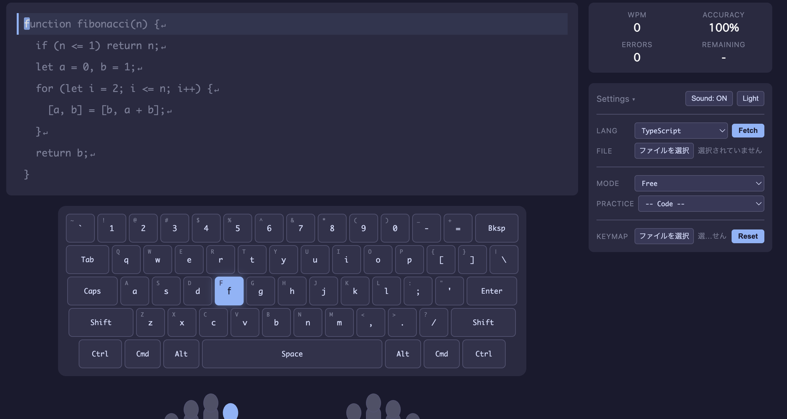

# Typetune

A typing practice app designed for custom keyboard enthusiasts. Load your own keyboard layout (VIA, Vial, ZMK), practice typing real code snippets, and visualize per-finger weaknesses.

**[Try it live](https://typetune.online)**



## Features

- **Custom Keyboard Layouts** - Import VIA, Vial, or ZMK config files to practice with your actual keyboard layout. Supports split keyboards, multiple layers, and rotary encoders.
- **Real Code Snippets** - Fetch code from GitHub repositories in 11 languages: JavaScript, TypeScript, Python, Go, Rust, Ruby, PHP, C#, Java, C++, and Swift.
- **Typing Modes** - Free mode, timed mode (default 60s), or character-count mode.
- **Finger Guide** - SVG hand illustration highlights which finger to use for the next key.
- **Error Heatmap** - After completing a session, see a color-coded breakdown of errors by finger.
- **Per-Finger Practice** - Built-in word lists targeting specific fingers (pinky, ring, middle, index).
- **Sound Feedback** - Optional keystroke sounds via Web Audio API.
- **Dark / Light Theme** - Catppuccin Mocha (dark) and Catppuccin Latte (light) themes.

## Getting Started

### Prerequisites

- Node.js (v18+)

### Install

```bash
git clone https://github.com/mostlyfine/typing.git
cd typing
npm install
```

### Development

```bash
npm run dev
```

### Build

```bash
npm run build
```

### Test

```bash
npm run test
npm run test:coverage
```

## Tech Stack

- Vanilla JavaScript (ES modules, no framework)
- [Vite](https://vite.dev/) for bundling and dev server
- [Vitest](https://vitest.dev/) for testing
- CSS Custom Properties for theming
- SVG for keyboard rendering and finger guide

## Architecture

```
src/
├── core/           # Business logic
│   ├── typing-engine.js    # Input handling, stats, modes
│   ├── text-provider.js    # Text loading (GitHub, file, presets)
│   ├── event-bus.js        # Pub/sub for component communication
│   ├── keymap-loader.js    # Keyboard config loading
│   ├── via-parser.js       # VIA format parser
│   ├── vial-parser.js      # Vial format parser
│   ├── zmk-parser.js       # ZMK format parser
│   └── sound.js            # Audio feedback
├── ui/             # UI components
│   ├── keyboard.js         # Keyboard visualization
│   ├── text-display.js     # Text and cursor display
│   ├── stats-display.js    # WPM, accuracy, errors
│   ├── finger-guide.js     # SVG hand illustration
│   └── settings-panel.js   # Settings UI
└── data/           # Static data
    ├── repo-list.js        # GitHub repos for code fetching
    ├── practice-presets.js  # Finger-specific word lists
    ├── key-finger-map.js   # Key-to-finger mapping
    ├── key-labels.js       # ZMK keycode labels
    └── default-layout.js   # Default QWERTY layout
```

Components communicate through a custom `EventBus` - no framework dependencies, just clean pub/sub messaging.

## Loading a Custom Keyboard

1. Export your keyboard config from [VIA](https://usevia.app/), [Vial](https://get.vial.today/), or your ZMK keymap file.
2. Click the **KEYMAP** file picker in the sidebar.
3. Select your config file - the keyboard display updates automatically.

## License

MIT
